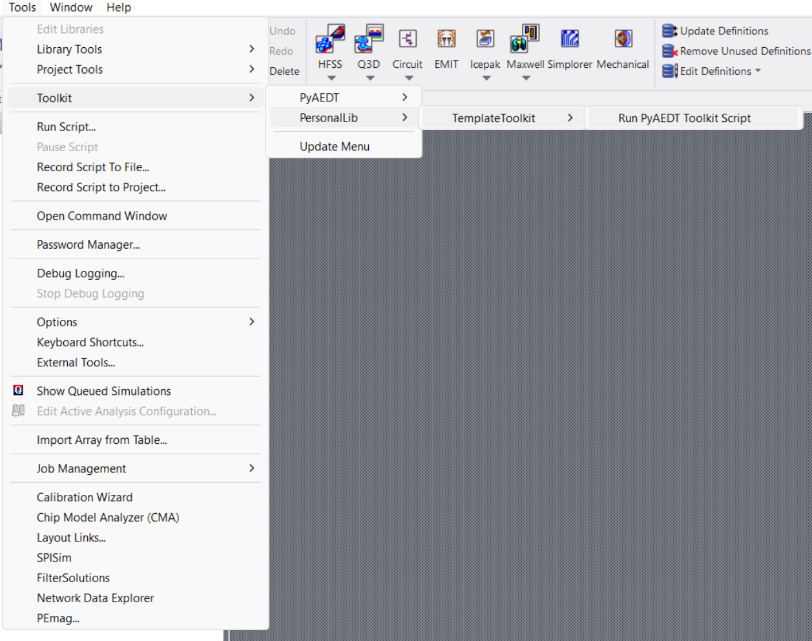

===============
Getting started
===============

To run this toolkit, you must have a licensed copy of Ansys Electronics Desktop (AEDT) installed.

The toolkit could be used inside AEDT or launched from a python console. Toolkit features are accessible from the
user interface **Toolkit Template Wizard** or the directly from the API.

Install the toolkit inside AEDT and run the UI using CPython 3.7 from AEDT installation
---------------------------------------------------------------------------------------

The toolkit could be installed inside AEDT using
`PyAEDT <https://aedt.docs.pyansys.com/version/stable//>`_.

You could install PyAEDT and all dependencies using the CPython 3.7 base interpreter from AEDT installation,
PyAEDT installation documentation has a batch file for easy installation.

#. Download and execute the batch file from PyAEDT documentation. `Install PyAEDT from a batch file <https://aedt.docs.pyansys.com/version/stable/Getting_started/Installation.html#install-from-a-batch-file>`_.

#. Open the console:

    .. image:: ./_static/toolkits.png
      :width: 800
      :alt: PyAEDT toolkits in AEDT

    .. image:: ./_static/console.png
      :width: 800
      :alt: PyAEDT console in AEDT

#. Connect to the desktop and run the `add toolkit method <https://aedt.docs.pyansys.com/version/stable/API/_autosummary/pyaedt.desktop.Desktop.add_custom_toolkit.html#pyaedt.desktop.Desktop.add_custom_toolkit>`_:

    .. code:: python

      desktop.add_custom_toolkit("TemplateToolkit")
      exit()

#. Close the console and open the toolkit:

    .. image:: ./_static/toolkit_in_AEDT.png
      :width: 800
      :alt: PyAEDT template toolkit in AEDT

Install the toolkit inside AEDT and run the UI for any CPython base interpreter
-------------------------------------------------------------------------------

The toolkit could be installed inside AEDT using
`PyAEDT <https://aedt.docs.pyansys.com/version/stable//>`_.

If you have an existing virtual environment, you can skip step 1, and
if you have PyAEDT installed, you can skip step 2.

#. Create a fresh-clean Python environment and activate it:

   .. code:: bash

      # Create a virtual environment
      python -m venv .venv

      # Activate it in a POSIX system
      source .venv/bin/activate

      # Activate it in a Windows CMD environment
      .venv\Scripts\activate.bat

      # Activate it in Windows PowerShell
      .venv\Scripts\Activate.ps1

#. Install PyAEDT by run this command:

    .. code:: bash

      python -m pip install pyaedt

#. Open python console:

    .. code:: bash

      python

#. Open AEDT by run this command:

    .. code:: python

        # Launch AEDT
        from pyaedt import Desktop

        aedtapp = Desktop(
            specified_version="2023.1",
            non_graphical=False,
            new_desktop_session=True,
            close_on_exit=True,
            student_version=False,
        )
        # Install toolkit inside AEDT
        aedtapp.add_custom_toolkit("ToolkitTemplate")
        # Desktop is released here
        aedtapp.release_desktop()

#. Open AEDT manually and run the toolkit:

Install the toolkit in the console and run the UI
-------------------------------------------------

If you have an existing virtual environment you can skip step 1,
if you have installed the toolkit in the virtual environment you can skip step 2:

#. Create a fresh-clean Python environment and activate it:

   .. code:: bash

      # Create a virtual environment
      python -m venv .venv

      # Activate it in a POSIX system
      source .venv/bin/activate

      # Activate it in a Windows CMD environment
      .venv\Scripts\activate.bat

      # Activate it in Windows PowerShell
      .venv\Scripts\Activate.ps1

#. Install the toolkit from git:

    .. code:: bash

      python -m pip install git+https://github.com/pyansys/pyaedt-toolkit-template.git

#. Launch the toolkit UI:

    .. code:: bash

      python .venv\Lib\site-packages\ansys\aedt\toolkits\template\template_toolkit.py

    .. image:: ./_static/template_toolkit_wizard.png
      :width: 800
      :alt: Antenna Toolkit UI, Settings Tab

Install the toolkit in the console and use the API
--------------------------------------------------

If you have an existing virtual environment you can skip step 1,
if you have installed the toolkit in the virtual environment you can skip step 2:

#. Create a fresh-clean Python environment and activate it:

   .. code:: bash

      # Create a virtual environment
      python -m venv .venv

      # Activate it in a POSIX system
      source .venv/bin/activate

      # Activate it in a Windows CMD environment
      .venv\Scripts\activate.bat

      # Activate it in Windows PowerShell
      .venv\Scripts\Activate.ps1

#. Install the toolkit from git:

    .. code:: bash

      python -m pip install git+https://github.com/pyansys/pyaedt-antenna-toolkit.git

#. Open a python console:

    .. code:: bash

      python

#. Open AEDT and draw a box in a random position by run these commands:

    .. code:: python

        # Launch AEDT
        from pyaedt import Hfss

        aedtapp = Hfss(
            specified_version="2023.1",
            non_graphical=False,
            new_desktop_session=True,
            close_on_exit=True,
        )
        # Import backend
        from ansys.aedt.toolkits.template.backend.template_script import TemplateBackend

        # Backend object
        template = TemplateBackend(aedtapp)

        # Create a box in a random position
        b = template.draw_box()

        # Desktop is released here
        aedtapp.release_desktop()
