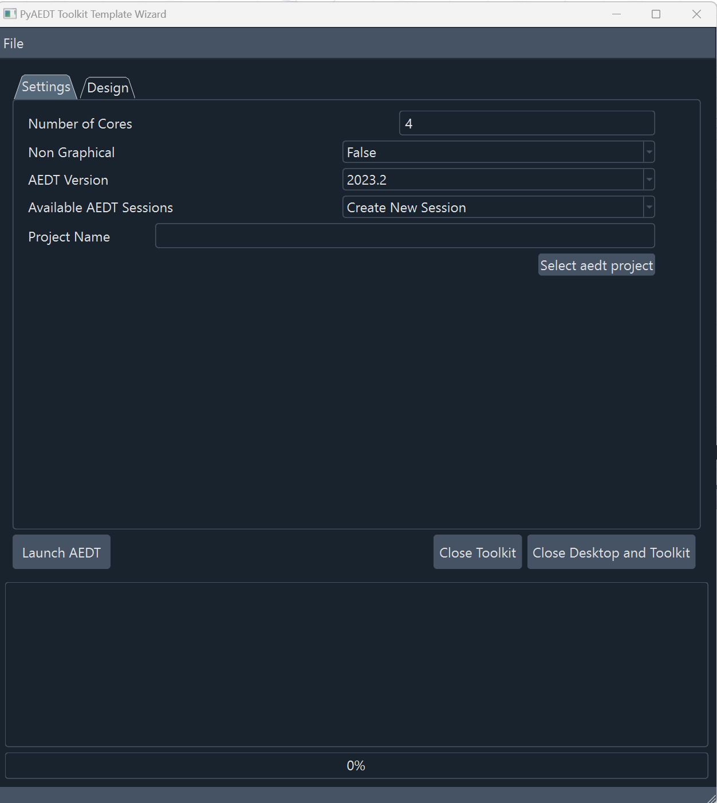
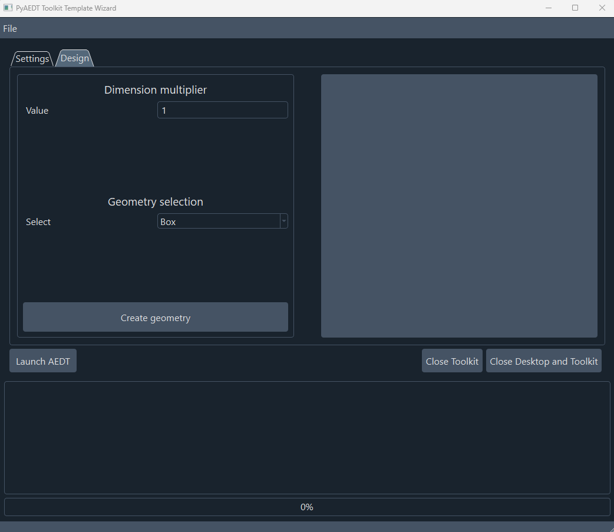

================
Wizard reference
================

This section describes user interface available in AEDT's **Toolkit Template Wizard**.
To run **Toolkit Template Wizard**, you must have a licensed copy of Ansys Electronics
Desktop (AEDT) installed.

Once **Toolkit Template Wizard** is launched user can choose settings from first page and connect to an existing
Electronics Desktop session or create a new session.

After Electronics Desktop is launched, user can assign a multiplier value which is applied to the dimensions of
the geometry selected in the combo box (box or sphere). The user can push the button **Create geometry** and it
creates the selected geometry with a random position and color.

