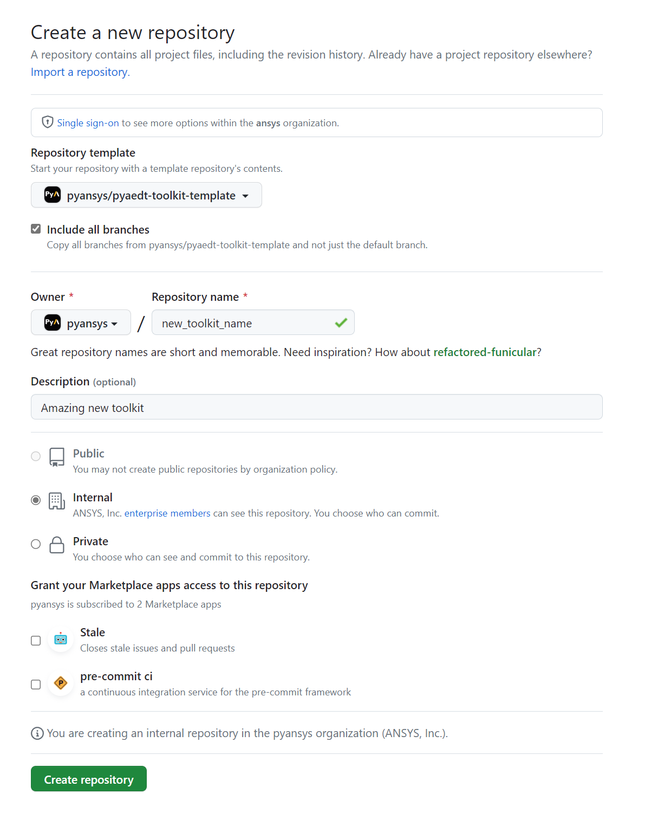

======================
New toolkit guidelines
======================

This repository is a template for any new AEDT toolkit. It standardizes AEDT toolkits implementation.

The **AEDT Toolkit Template** is a working toolkit able to connect to an existing AEDT session, open an existing
AEDT project or initialize a new AEDT session, which should be the basic capability of any toolkit.
In addition, it creates boxes and spheres in random positions as an example of AEDT control.

There are common parts which should not be modified, and others which could be different depending on
the new toolkit implementation. In the following sections, it is defined best practices to implement your own toolkit.

The architecture is split in two main parts:

1. The backend, using `Flask <https://flask.palletsprojects.com/en/2.3.x/>`_. Flask creates a REST API,
which let interact different services by simply doing HTTP requests.

2. The frontend, using `Pyside6 <https://doc.qt.io/qtforpython-6/quickstart.html>`_. Pyside6 has a designer tool
which allows to create user interfaces and it is translated to python directly.

Using Flask, the toolkit will be user interface agnostic, then you can decide change it and use a WebUI for instance
as user interface.

Toolkit architecture
--------------------

Toolkit architecture is defined with the following structure of folders and files:

.. code-block:: text

   pyaedt-toolkit-template
   ├── .github
   │   └──workflows
   │      └── ci_cd.yml
   ├── doc
   │   └──source
   │      ├── Toolkit
   │      │   └── toolkit_docs.rst
   │      └── generic_docs.rst
   ├── src.ansys.aedt.toolkits
   │    └──template
   │       ├── backend
   │       │   ├── common
   │       │   ├── backend.py
   │       │   ├── properties.json
   │       │   └── service.py
   │       ├── ui
   │       │   ├── common
   │       │   │   └── toolkit.ui
   │       │   ├── frontend.py
   │       │   └── frontend_toolkit.py
   │       └── run_toolkit.py
   ├── tests
   │   └── tests_files
   ├── pyproject.toml
   └── README.rst

1. `github <https://github.com/ansys/pyaedt-toolkit-template/tree/main/.github>`_ contains the Github actions, you do not need to modify these files until the first pull request.

2. `doc <https://github.com/ansys/pyaedt-toolkit-template/tree/main/doc>`_ contains the documentation structure.

3. `template <https://github.com/ansys/pyaedt-toolkit-template/tree/main/src/ansys/aedt/toolkits/template>`_ contains the toolkit code. It is split in backend and frontend. It contains a script called "run_toolkit.py" which launches backend and frontend in two threads.

    3.1 `backend <https://github.com/ansys/pyaedt-toolkit-template/tree/main/src/ansys/aedt/toolkits/template/backend>`_: You will find two main files, **backend.py** where the entrypoints are defined and **services.py** which has toolkit API.

    3.2 `ui <https://github.com/ansys/pyaedt-toolkit-template/tree/main/src/ansys/aedt/toolkits/template/ui>`_: You will find two main files, **frontend.py** and **frontend_toolkit.py**.

4. `tests <https://github.com/ansys/pyaedt-toolkit-template/tree/main/tests>`_: folder contains the unit test of the backend.

Create a new repository in GitHub
---------------------------------

The first step is to create a new repository, it could be Private, Internal, or Public,
you could start making it Private.

You could create this repository inside the `Ansys organization <https://github.com/ansys>`_.
If you're an employee of `Ansys Inc. <https://github.com/ansys>`_,
you can join the organization by visiting
`Join Ansys GitHub Organization. <https://github.com/orgs/ansys/sso>`_.

If you're external to Ansys but want to contribute to adding a new toolkit,
please open an issue on `PyAEDT <https://aedt.docs.pyansys.com/version/stable//>`_.

The naming convention for PyAEDT toolkits is pyaedt-toolkit-**new_toolkit_name**.

Choose the PyAEDT toolkit template as the repository template and include all branches.

Clone the repository locally
----------------------------

Duplicate the new repository in a local repository.

#. Open Git Bash.

    .. code:: bash

      cd New-REPOSITORY-Path
      git clone https://github.com/pyansys/pyaedt-toolkit-new_toolkit_name.git

Modify general settings
-----------------------

There are some parts in the repository which are specific for each different toolkit and must be modified manually.

#. Modify the folder name src/ansys/aedt/toolkits/toolkit_name/template to
src/ansys/aedt/toolkits/new_toolkit_name

#. Modify .github/workflows/ci_cd.yml file, from line 16 to 20, with the specific toolkit name.

#. Modify .github/workflows/ci_cd.yml file, line 89, with the specific toolkit name.

#. Modify .pre-commit-config.yml file, line 3, with the corresponding UI path.

#. Modify pyproject.toml file, line 7 and 9, with the corresponding toolkit name and description.

#. Modify pyproject.toml file, line 57, with the corresponding toolkit name.

#. Modify pyproject.toml file, from line 60 to 62, with the corresponding toolkit name.

Install default dependencies
----------------------------

You can install in the virtual environment the basic packages to run a PyAEDT toolkit, like pyaedt or pyside6.

.. code:: bash

  pip install .
  pip install .[tests]
  pip install .[doc]
  pip install pre-commit
  pre-commit install

Create backend
--------------

The backend part controls all related to AEDT. It should contain code which could be launched without a user interface.

On this repository you have a simple example, you can find in other toolkits more examples of how to develop a backend.
It should be created in src/ansys/aedt/toolkits/new_toolkit_name/backend.

Create unit test
----------------

If the repository has a backend, you should create unit test for each different method, this increase
the maintainability of your code. File tests/test_00_template.py contains unit test for the backend methods.

Depending on the complexity of the unit tests, it could need AEDT or not to run the tests.

If AEDT needs to be run, the GitHub actions try to connect to a runner called *pyaedt-toolkits*, please submit an issue
on the `PyAEDT Issues <https://github.com/pyansys/PyAEDT/issues>`_ page.

If the unit tests do not need AEDT, then you could modify the .github/workflows/ci_cd.yml and remove line 63.

Create user interface
---------------------

If you installed the default dependencies, you installed pyside6, which allows to create user interfaces.
Please visit its website for more information.
General guidelines for user interface implementation are:

#. Open the designer.

    .. code:: bash

       pyside6-designer

#. Open the user interface template in src/ansys/aedt/toolkits/new_toolkit_name/ui/toolkit.ui.

#. Modify it and save it.

#. Create a new python script, which contains these modifications.

    .. code:: bash

        pyside6-uic src\ansys\aedt\toolkits\new_toolkit_name\ui\toolkit.ui -o src\ansys\aedt\toolkits\new_toolkit_name\ui\ui_main.py

#. Create your script to control this user interface.

Create documentation
--------------------

The documentation is created automatically using Sphinx. You need to define the structure in the doc/source/index.rst

#. Modify doc/source/conf.py lines 16, 20, 31, 36, 46 and 57 with the toolkit name.

#. Remove the file doc/source/Toolkit_template.py and line 12 from doc/source/index.rst.

#. Modify README.rst, this is the first page when you open the documentation.

#. Modify all rst files in doc/source

#. You can build the documentation locally:

    .. code:: bash

        cd doc\source
        create_documentation.bat

#. To publish the documentation online, you need to submit an issue on the `PyAEDT Issues <https://github.com/pyansys/PyAEDT/issues>`_ page.

Add toolkit in PyAEDT
---------------------

Create an issue on the `PyAEDT Issues <https://github.com/pyansys/PyAEDT/issues>`_ page.